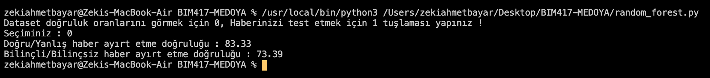
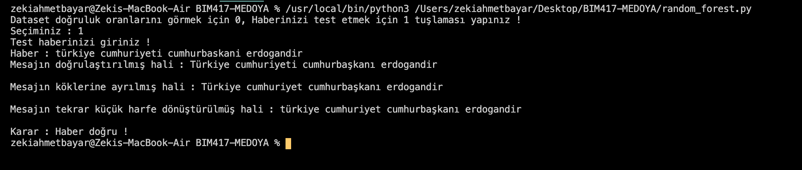
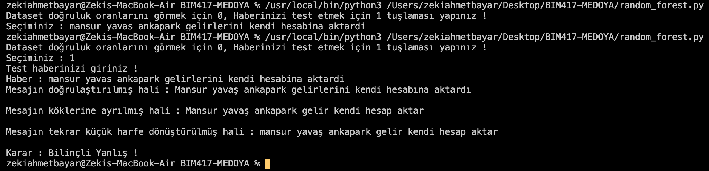
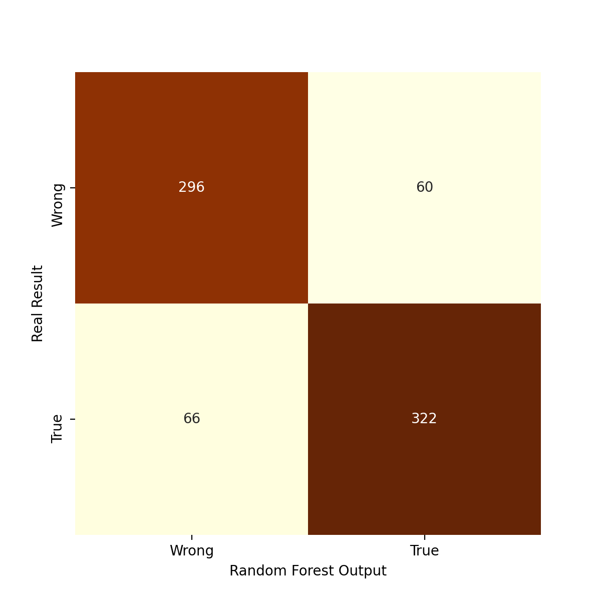
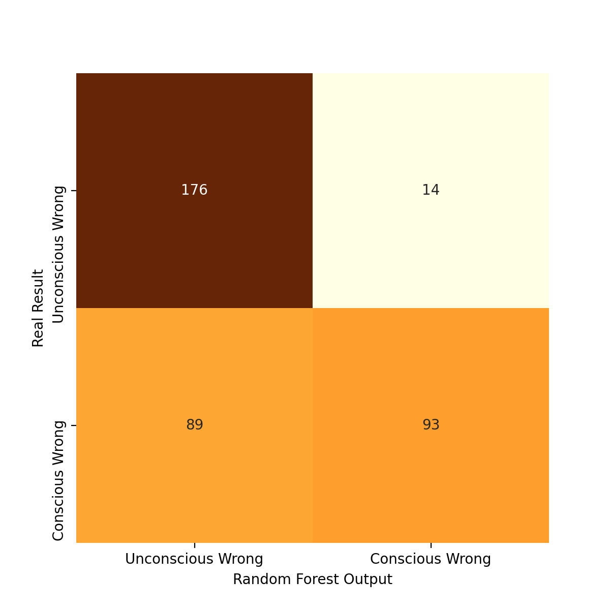

# TurkishFakeNewsDetection

## A. Giriş, Proje hakkında açıklama

Sistemin gerçeklenmesi için gerekli olan konu **iç politika**, kullanacağım verilerin toplanacağı platformu **Twitter**, toplama zamanını ise ülkemizin iç siyasetinin son yıllarda değişen ekonomik şartlar ve yönetim biçimlerine bağlı olarak diğer yıllara oranla keskin değişkenlik göstermeye başladığı yıl olan **2017’nin başlangıcından günümüze kadar** olarak belirlenmiştir.

Algoritmanın ilgili sisteme entegre edilmiş ve 2.480 haber ile hem veri setindeki haberlerin %75 öğrenme, %25 test verisi olarak öğrenip kendini test etmesi hem de dışardan verilen bir haberin kontrolü sağlanmıştır.

## B. Yazılım Nasıl Kullanılır ?

Yazılım temel olarak 3 modülden oluşmaktadır. Bu modüllerin kendi içlerinde metodlara bölünerek tasarlanması sayesinde programın kullanılabilirliği arttırılması amaçlanmıştır. Bu modülleri açıklamak gerekirse;

- scraper.py - Sisteme gerekli olan veriyi çekmek amacı ile inşa edilmiştir. Girdi olarak anahtar kelime, hashtag veya kullanıcı adının yanı sıra toplanmak istenen verilerin başlangıç tarihini ve istenen tweet sayısını alan modül çıktı olarak istenen sayıda tweetin bulunduğu bir .csv dosyası verir.
  
- after_scrape.py - Sistemden aldığı ham veriyi alıp NLP teknikleriyle işleyerek bir sonraki aşama için hazır hale getirir.

- random_forest.py - Bir önceki aşamadan aldığı işlenmiş veriyi girdi olarak alarak kullanıcının isteğine göre yeni bir haberin doğruluğunu test edebilir. Buna ek olarak isteğe bağlı olarak veri kümesine ait doğruluk değerlerini döndürür.
  
Her bir modülün görevleri açıklandıktan sonra kullanım aşamasından daha rahat bahsedilebilir.
Öncelikle scraper.py dosyası kullanımından başlamak gerekirse, bu dosyayı kullanıp çalıştırabilmek için programlama bilgisi dışında Twitter tarafından verilen Twitter API erişim iznine sahip olmak gerekmektedir.
Twitter üzerinden veri toplamak için dahil olunan bu programa bu adresten dahil olunabilir. Ben literatür taraması esnasında bu erişime ihtiyaç olduğunu farkedip başvuru yapmam sonucunda 2 gün gibi kısa bir sürede sorulan soruları cevaplayarak bu erişime sahip oldum. Buna istinaden programı çalıştırmak için aşağıdaki gereksinimlere sahip olmak gerekmektedir,

• Twitter API Developer programına dahil olmak,
• Twitter API bünyesinde bir proje oluşturmuş olmak,
• Bu projeye ait secret/consumer_key ve profilinize ait secret/access_token bilgilerine sahip olmak.

Bu izinlere sahip olunduğundan emin olduktan sonra scraper.py dosyasında yer alan, 

*scrapetweets(username, search_words, date_since, numTweets, numRuns)* fonksiyonuna gerekli parametreler aşağıda belirtildiği üzere verilir.

• search_words = “akp OR bakan OR Recep or Tayyip OR Erdoğan" 
• date_since = '2017-01-01'
• numTweets = 5000
• numRuns = 1
• username = *'username'*

Parametreler verildikten sonra fonksiyon yukarıda belirtildiği üzere çağırılır. Burada dikkat edilmesi gereken alan, eğer kullanıcıdan veri çekilmek isteniyorsa fonksiyon içerisinde yer alan,

*tweets=* *tweepy.Cursor(api.user_timeline, id = username, q=search_words, lang="tr", since=date_since, tweet_mode=‘extended’).items(numTweets)
satırında yer alan ‘api.user_timeline’* 

kısmı aynen bırakılmalı, eğer kelimeler ile arama yapılmak isteniyorsa bu kısım ‘api.search’ haline getirilmelidir. Aynı anda hem tweet hem anahtar kelime araması gerçekleştirilememektedir.

İstenilen parametreler ayarlanıp program çalıştırıldıktan sonra sistem bulunduğu dizine output.csv adında bir dosya oluşturacaktır. Bu dosya istediğiniz kullanıcının ya da anahtar kelimelerle alakalı tweetleri içeren dosyadır.

Bu dosyayı elde ettikten sonra after_scrape.py dosyasına geçiş yapılabilir. after_scrape.py dosyasında veri toplama işleminden sonra gerçekleştirilmesi gereken metin ön işleme işlemleri bulunmaktadır. Bu modülde yer alan 3 ana methodun yanında 3 adet yardımcı method bulunmaktadır. Ana methodlar yardımcı methodların da yardımı ile veriyi temizler.

after_scrape.py modülünü çalıştırırken herhangi bir parametre ayarlanmasına gerek yoktur. Programın çalıştırılması yeterlidir. Çıktı olarak bulunduğu dizine final.csv adında temizlenmiş veriyi içeren bir .csv dosyası oluşturur.

Metin ön işleme işleminden sonra, son kalan işlem verilerin Random Forest algoritmasına öğretilerek test edilmesidir. Burada random_forest(data_path,test_data,step) methodunun da çalışması için parametreleri her sistem için ortak şekilde ayarlanmıştır. Dosya çalıştırıldıktan sonra kullanıcı tercihlerine göre yönetilerek çıktılar vermektedir.

## C. Yazılımı Çalıştırmak için Gereksinimler Nelerdir ?
Yazılımı çalıştırmak için temel olarak Python kütüphanelerine gereksinim duyulduğundan yukarıda bahsedilmiştir. Buna istinaden yüklenmesi gereken kütüphanelerin bir listesi ve nasıl yükleneceği aşağıda verilmiştir.

Öncelikle Python ve Python kütüphanelerini yüklemek için gerekli olan paket olan pip3 paketinin önceden sistemde yüklenmiş olması gerekmektedir. Bu paketi yüklemek için GNU/Linux ve MacOS sistemlerde,

- GNU/Linux
  - Debian - sudo apt install python python3-pip 
  - Rhel   - sudo yum install python python3-pip
  
- MacOSX
  - sudo brew install python3-pip
  
Bu gereksinimlere sahip sistemlerde gerekli olan kütüphanelerin listesi aşağıda yer almaktadır.

• tweepy - Tweet çekme işlemi için gerekli olan Python kütüphanesi.
• pandas - Veri düzenleme işlemi için gerekli olan Python kütüphanesi. 
• csv - Veri çıktısı alma işlemi için gerekli olan Python kütüphanesi.
• string - Metin ön işleme işlemi için gerekli olan Python kütüphanesi. 
• trnlp - Metin ön işleme işlemi için gerekli olan Python kütüphanesi.
• os - Çıktı alma işlemi için gerekli olan Python kütüphanesi.
• re - Metin ön işleme işlemi için gerekli olan Python kütüphanesi.
• logging - Sistem loglarının tutulması işlemi için gerekli olan Python
kütüphanesi.
• emoji - Metin ön işleme işlemi için gerekli olan Python kütüphanesi.
• pickle - Model çıktısını kaydetme işlemi için gerekli olan Python kütüphanesi.
• numpy - Veri düzenleme işlemi için gerekli olan Python kütüphanesi.
• sklearn - Random forest sınıflandırıcısı ve çıktıların görselleştirilmesi işlemleri için gerekli olan Python kütüphanesi.

Listede verilen tüm kütüphaneler, pip3 install <lib_name> şeklinde sisteme yüklenebilmektedir.

## D. Çalışma Örnekleri

Sistemin iki aşamalı olarak çalıştığı daha önceki başlıklarda belirtilmiştir. Burada da hatırlatmak gerekirse, sistem öncelikle size test haberi mi vereceğinizi yoksa sadece öğrenme kümesinin doğruluk oranlarını mı görmek istediğinizi sormaktadır. Eğer cevabınız doğruluk oranlarını görmek ise aşağıdaki gibi bir çıktı ile karşılaşırsınız.

Eğer kendi haber metninizi test etmek istiyorsanız, burada da haber doğru/bilinçli yanlış haber/bilinçsiz yanlış haber gibi 3 adet sonuçla karşılaşmanız mümkündür. Bu noktada aşağıdaki gibi çıktılar görüntülenecektir.

## E. Sonuçlar ve Yorumlanması

Sonuçlar, karmaşıklık matrisleri, doğruluk değerleri, kesinlik değerleri, anmayı ve f-ölçütünü baz alınarak yorumlanacaktır.

Yukarıdaki karmaşıklık matrisleri incelendiğinde varılan sonuç, sistemin doğru/yanlış habere iyi derecede karar verdiği ancak bilinçli/bilinçsiz haberler konusunda ise muhtemelen veri setinden kaynaklı olarak sistemin oldukça sorunlu karar verdiği gözlenebilmektedir.
Bu sorunun giderilebilmesi için veri setinin arttırılıp düzenlenmesi gerekmektedir.

Karmaşıklık matrislerine ek olarak doğruluk değerlerini F bölümündeki çalışma örneklerinden gözlediğimiz üzere,

• Doğru/Yanlış Haber için : %83.33
• Bilinçli/Bilinçsiz Haber için : %73.33
olarak belirlenmiştir. Bu oranlar da karmaşıklık matrislerini destekler niteliktedir.

Doğruluk değerlerine ek olarak kesinlik, anma ve f1 ölçütü değerlerini incelersek,

• Doğru/Yanlış haber kararı için, • Kesinlik : 0.83
• Anma : 0.83
• F1 ölçütü : 0.83
• Test edilen veri : 744
• Bilinçli/Biliçsiz yanlış haber kararı için, • Kesinlik : 0.77
• Anma : 0.73
• F1 ölçütü : 0.72
• Test edilen veri : 372

Bu ölçütlerin sistem hakkında verdiği fikri şu şekilde anlayabiliriz. Bu ölçüt sonuçları 1’e ne kadar yakınsa sistem doğruluğu da o kadar yüksek olmaktadır. Bu bilgiye dayanarak söyleyebiliriz ki, sistemin bilinçli/bilinçsiz haber kararı doğruluğu, doğru/yanlış haber kararı doğruluğundan düşüktür ve bilinçli/ bilinçsiz haber kararının iyileştirilmesi gerekmektedir.

Buna ek olarak sistemin eğitilen ve test edilen veri sayılarına göre verdiği çıktılar öngörülebilir çıktılardır. Nitekim 1240 veri ile eğitilen doğru/yanlış kararı %83 doğruluk ile çalışırken, 620’şer veri ile eğitilen bilinçli/bilinçsiz haber kararlarının doğruluğunun %73 çıkması normal görülmektedir. Sistem veri setindeki veri sayısı arttırılarak bu soruna çözüm bulunacaktır.

## F. Gelecekte Yapılabilecekler

Program genel itibarı ile şu anda yalnızca iç politika hakkındaki haberlerin doğru/yanlış olma durumu ile ilgilenmektedir. Buna ek olarak bu konuda verdiği kararlar da oldukça sınırlı bir veri setine dayanmaktadır.
Gelecekte veri seti arttırılarak ve çeşitlendirilerek hem sosyal mecrada sıklıkla karşılaşılabilecek olan konular hakkında yeni veriler toplanıp algoritmaya entegre edilebilir, hem de sınırlı olan veri kaynağı arttırılarak kararın doğruluğu arttırılabilir.
Kullanımın yaygınlaşması için en çok kullanılan tarayıcı olan Google Chrome üzerine bir eklenti haline getirilerek sosyal medyada karşılaşılan haberlerin doğruluğu tıpkı Google Çeviri eklentisi gibi haberin seçildikten sonra üzerinde gözüken bir butona tıklayarak haberin doğru/yanlış olma olasılığı kullanıcı ile paylaşılabilir.

## G. Kullanılan Kaynaklar

• Altunbey Özbay, Feyza. “Çevrimiçi sosyal medyada sahte haber tespiti.” Dergipark, Dergipark, 11 1 2020, https://dergipark.org.tr/en/download/article- file/1023416. Accessed 04 01 2021.
• CAN, Fazlı, et al. “Information Retrieval on Turkish Texts.” Information Retrieval on Turkish Texts, Bilkent Information Retrieval Group, 1 2 2008, http:// repository.bilkent.edu.tr/bitstream/handle/11693/23211/ Information%20retrieval%20on%20turkish%20texts.pdf? sequence=1&isAllowed=y. Accessed 4 1 2021.
• BIM 417 Ders Slaytları ve rapor taslağı.